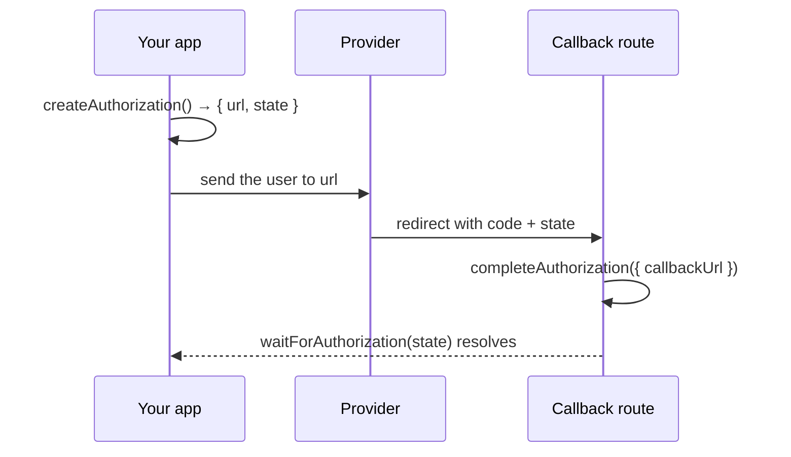

<div align="center">


<p>
<a href="https://www.npmjs.com/package/ai-oauth-sdk"><picture><source media="(prefers-color-scheme: dark)" srcset="https://www.shieldcn.dev/npm/v/ai-oauth-sdk.svg?variant=secondary&amp;size=xs&amp;mode=dark"></picture></a>
<a href="https://github.com/themonk-dev/ai-oauth-sdk/actions/workflows/ci.yml"><picture><source media="(prefers-color-scheme: dark)" srcset="https://www.shieldcn.dev/github/ci/themonk-dev/ai-oauth-sdk.svg?variant=secondary&amp;size=xs&amp;mode=dark"></picture></a>
<a href="https://github.com/themonk-dev/ai-oauth-sdk/stargazers"><picture><source media="(prefers-color-scheme: dark)" srcset="https://www.shieldcn.dev/github/stars/themonk-dev/ai-oauth-sdk.svg?variant=secondary&amp;size=xs&amp;mode=dark"></picture></a>
<a href="https://github.com/themonk-dev/ai-oauth-sdk/graphs/contributors"><picture><source media="(prefers-color-scheme: dark)" srcset="https://www.shieldcn.dev/github/contributors/themonk-dev/ai-oauth-sdk.svg?theme=emerald&amp;size=xs&amp;mode=dark"></picture></a>
<a href="https://github.com/themonk-dev/ai-oauth-sdk/commits/main"><picture><source media="(prefers-color-scheme: dark)" srcset="https://www.shieldcn.dev/github/last-commit/themonk-dev/ai-oauth-sdk.svg?variant=secondary&amp;size=xs&amp;mode=dark"></picture></a>
<a href="LICENSE"><picture><source media="(prefers-color-scheme: dark)" srcset="https://www.shieldcn.dev/github/license/themonk-dev/ai-oauth-sdk.svg?variant=ghost&amp;size=xs&amp;mode=dark"></picture></a>
</p>

[Quickstart](#quickstart) · [Providers](#providers) · [Credentials](docs/credentials.md) · [Recipes](docs/recipes.md) · [Security](SECURITY.md) · [Disclaimer](DISCLAIMER.md)

</div>

<br />

Every AI coding CLI — Codex, Claude Code, Gemini CLI, opencode — ships its own copy of
the same 400 lines: mint a PKCE pair, open a browser, catch the callback on a loopback
port, exchange the code, refresh before expiry.

This is that logic, extracted once, with the provider quirks already encoded. It does
one job — **redirect the user, receive the callback, hand you the token** — and nothing
else. No API client, no proxy, no model wrappers.

```bash
npx @ai-oauth-sdk/cli login openai
```

```ts
import { login, publicClientIds } from 'ai-oauth-sdk/node'

// You name the client id, like Passport. Nothing presents as a vendor's CLI by accident.
const { accessToken } = await login('openai', { clientId: publicClientIds.openai })
```

---

## Why

Nominally it's standard OAuth 2.0 + PKCE. In practice every provider bends it:

| | ChatGPT | Claude | Gemini | Copilot | OpenRouter |
|---|---|---|---|---|---|
| **Callback** | loopback `:1455` | hosted, paste `code#state` | loopback, any port | none — device code | loopback |
| **Token body** | form | form *(JSON times out)* | form + secret | form | **JSON** |
| **Returns** | `access_token` | `access_token` | `access_token` | `access_token` | **`key`** |
| **Echoes `state`** | yes | yes | yes | — | **no** |

Encoding those differences is most of the work, and it's exactly the part that gets
copy-pasted and drifts. Here it's a declarative descriptor per provider, with two escape
hatches for the ones that leave the spec entirely.

---

## Runs anywhere

One core with **zero dependencies**, and a thin adapter per runtime.

| Runtime | Package | Callback strategy |
|---|---|---|
| Terminal | [`@ai-oauth-sdk/cli`](packages/cli) | `npx @ai-oauth-sdk/cli login openai` |
| Node · Bun · Deno | [`@ai-oauth-sdk/node`](packages/node) | local server on `127.0.0.1` |
| Browser · SPA | [`@ai-oauth-sdk/browser`](packages/browser) | popup, or full-page redirect |
| React · Vue · Svelte · Solid | [`react`](packages/react) [`vue`](packages/vue) [`svelte`](packages/svelte) [`solid`](packages/solid) | `useAuth()` / `$auth` / signals |
| React Native · Expo | [`@ai-oauth-sdk/react-native`](packages/react-native) | deep link or auth session |
| `<script>` tag | CDN bundle | popup / redirect, `window.AIOAuth` |
| Headless · SSH · CI | any | paste, or RFC 8628 device code |

> [!NOTE]
> **React Native needs no polyfills.** Hermes has no `crypto.subtle`, so PKCE falls back
> to a bundled pure-JS SHA-256. The OAuth path also never touches `URL.searchParams` or
> the `URLSearchParams` constructor, both of which are unusable on bare RN. Randomness is
> the one thing that never degrades — with no CSPRNG it throws rather than quietly using
> `Math.random()` for your `state`.

---

## Quickstart

<details open>
<summary><b>⌘ Terminal</b></summary>

```bash
npm i -g @ai-oauth-sdk/cli

ai-oauth-sdk login openai
curl -H "Authorization: Bearer $(ai-oauth-sdk token openai)" \
     https://api.openai.com/v1/models
```

`token` prints the bare token and nothing else, so `$(...)` is always clean. To keep it
out of your shell history entirely:

```bash
ai-oauth-sdk exec openai -- ./deploy.sh   # arrives as $AI_OAUTH_SDK_TOKEN
```

</details>

<details>
<summary><b>⬢ Node · Bun · Deno</b></summary>

```ts
import { login, createNodeAuthClient, publicClientIds } from 'ai-oauth-sdk/node'

// Picks a receiver, opens the browser, catches the callback,
// stores tokens in ~/.ai-oauth-sdk/auth.json (0600).
await login('anthropic', { clientId: publicClientIds.anthropic })

const client = createNodeAuthClient({ provider: 'anthropic', clientId: publicClientIds.anthropic })
const accessToken = await client.getAccessToken()   // refreshes when near expiry
```

`login()` picks the right receiver for the machine: a loopback server on a desktop, and
paste-the-code over SSH or with no `DISPLAY`, where a loopback redirect could never
arrive.

**Calling the API:**

```ts
import { createAuthenticatedFetch } from 'ai-oauth-sdk/core'

const api = createAuthenticatedFetch(client)
await api('/v1/models')   // relative to the provider's apiBaseUrl
```

Attaches a valid token, adds the provider's required headers, and recovers from a 401 by
refreshing once and replaying — which matters because a token can be revoked well before
its nominal expiry, and only the 401 reveals it.

</details>

<details>
<summary><b>◐ Browser — popup or redirect</b></summary>

```ts
import { loginWithPopup, postCallbackToOpener } from 'ai-oauth-sdk/browser'

button.onclick = () => loginWithPopup('openai', { clientId, redirectUri })
```

On your redirect page: `postCallbackToOpener()`.

Full-page redirect instead, for embedded webviews and popup blockers:

```ts
import { createBrowserAuthClient, startRedirectLogin, handleRedirectCallback } from 'ai-oauth-sdk/browser'

const client = createBrowserAuthClient({ provider: 'openai', clientId })

// Safe to call unconditionally on startup — returns null when not a callback.
const tokens = await handleRedirectCallback(client)

button.onclick = () => startRedirectLogin(client)
```

The PKCE verifier lives in `sessionStorage` between the two page loads.

</details>

<details>
<summary><b>◈ React · Vue · Svelte · Solid</b></summary>

All four wrap the same store, so the API is deliberately parallel.

```tsx
// React & Vue
const { login, logout, tokens, isLoading, error } = useAuth({ provider: 'openai', clientId, receiver: popupReceiver() })
```

```svelte
<!-- Svelte -->
const auth = createAuth({ provider: 'openai', clientId, receiver: popupReceiver() })
{#if $auth.tokens} … {/if}
```

```tsx
// Solid
const auth = createAuth({ provider: 'openai', clientId, receiver: popupReceiver() })
<Show when={auth.tokens()}> … </Show>
```

</details>

<details>
<summary><b>▣ React Native · Expo</b></summary>

```ts
const client = createAuthClient({
  provider: 'openai',
  clientId,
  storage: secureStoreAdapter(SecureStore),   // Keychain / EncryptedSharedPreferences
})

await client.login({
  receiver: authSessionReceiver({ webBrowser: WebBrowser, redirectUri: 'myapp://auth/callback' }),
})
```

Bare RN uses `deepLinkReceiver({ linking: Linking, redirectUri })`, which also handles
the cold-start case where the OS killed your app during consent and delivers the redirect
as the *initial* URL.

</details>

<details>
<summary><b>◇ CDN</b></summary>

```html
<script src="https://cdn.jsdelivr.net/npm/ai-oauth-sdk/dist/ai-oauth-sdk.global.js"></script>
<script>
  const client = AIOAuth.createAuthClient({ provider: 'openai', clientId, redirectUri })
  const tokens = await client.login({ receiver: AIOAuth.popupReceiver() })
</script>
```

Self-contained, ~13 KB gzipped, no build step.

</details>

<details>
<summary><b>⌁ Headless — device code</b></summary>

```ts
const tokens = await client.deviceLogin({
  onCode: ({ verificationUri, userCode }) =>
    console.log(`Go to ${verificationUri} and enter ${userCode}`),
})
```

</details>

---

## The state-keyed handoff

The part that makes this a library rather than a snippet: **start a flow in one place,
collect the token in another**, correlated by `state`.



```ts
// 1. Start it — wherever
const { url, state } = await client.createAuthorization()

// 2. Finish it — wherever the callback actually lands
app.get('/callback', async (req, res) => {
  await client.completeAuthorization({ callbackUrl: req.url })
})

// 3. Or block on it — from a third place entirely
const tokens = await client.waitForAuthorization(state, { timeoutMs: 120_000 })
```

No race: a result that arrives before anyone waits is buffered, and multiple waiters on
one `state` all get served. Pending records persist through your storage adapter, so the
verifier survives a page navigation or a process restart.

→ [**docs/recipes.md**](docs/recipes.md) has complete callback routes for Hono, Express,
Fastify and Next.js, plus multi-user servers, database-backed storage and Electron.

---

## Tokens

```ts
await client.getAccessToken()      // valid token, refreshed if near expiry
await client.authorizationHeader() // "Bearer sk-ant-oat01-…"
await client.refresh()
await client.revoke()              // RFC 7009, where supported
await client.logout({ revoke: true })
```

Concurrent callers share **one** refresh, so ten parallel calls waking to an expired
token fire a single request. Several accounts at once via `accountKey: 'work'`.

---

## Providers

**You name the client id at initialization**, like Passport. No provider defaults to one.

```ts
createAuthClient({ provider: 'openai', clientId: publicClientIds.openai })  // that vendor's CLI
createAuthClient({ provider: 'openai', clientId: 'my-registered-client' })  // or your own
```

| Provider | Flow | Client id |
|---|---|---|
| `openai` | loopback `:1455` | `publicClientIds.openai` |
| `anthropic` | loopback, any port | `publicClientIds.anthropic` |
| `github-copilot` | device code | `publicClientIds['github-copilot']` |
| `qwen` | device code | `publicClientIds.qwen` *(experimental)* |
| `openrouter` | loopback | none — identified by callback URL |
| `google` | loopback, any port | `publicClientIds.google` + `publicClientSecrets.google` |
| `xai` | loopback `:56121` | `publicClientIds.xai` *(experimental)* |

Plus `microsoft({ clientId, tenant })` for Entra ID — a factory rather than a constant
because its endpoints are tenant-scoped.

> [!IMPORTANT]
> `publicClientIds` values **are not secrets** — they're public PKCE-only clients the
> vendors ship in their own binaries. But using one means *presenting your application as
> that CLI*, which is why it's an explicit argument rather than a default. Check the
> provider's terms before shipping it in a product.

> [!WARNING]
> **This is an unofficial project, and none of these providers supports third-party
> OAuth clients.** Everything here was derived from the vendors' own open-source CLIs and
> the RFCs they implement, so endpoints and client ids can change or stop working at any
> time. Read the [**disclaimer**](DISCLAIMER.md) before shipping this in a product.

→ [**docs/credentials.md**](docs/credentials.md) for the raw values, how to pass them
from the SDK or the CLI, and how to register your own instead.

Any other OAuth 2.0 provider works via `defineProvider()`, or
`providerFromDiscovery()` to build one from an OIDC document so an endpoint move needs
no release. The CLI takes the same escape hatch: `--authorize-url` / `--token-url`.

---

## Security

PKCE (S256) everywhere it applies. `state` verified in constant time on every callback,
and a callback carrying **no** `state` is rejected rather than waved through. Secure
randomness is mandatory — there is no `Math.random()` fallback. Credentials are scrubbed
from error messages before they reach your logs. The loopback server binds `127.0.0.1`,
answers `GET`/`HEAD` only, and serves exactly one callback.

→ [**SECURITY.md**](SECURITY.md) for the full threat model and reporting.

---

## Packages

| Package | Purpose |
|---|---|
| [`ai-oauth-sdk`](packages/ai-oauth-sdk) | Umbrella + CDN build. **Start here.** |
| [`@ai-oauth-sdk/core`](packages/core) | Zero-dep engine: PKCE, registry, exchange, refresh, providers |
| [`@ai-oauth-sdk/cli`](packages/cli) | `ai-oauth-sdk login …` for the terminal |
| [`@ai-oauth-sdk/node`](packages/node) | Loopback server, file storage, browser launcher |
| [`@ai-oauth-sdk/browser`](packages/browser) | Popup + redirect receivers, web storage |
| [`react`](packages/react) · [`vue`](packages/vue) · [`svelte`](packages/svelte) · [`solid`](packages/solid) | UI bindings over one shared store |
| [`@ai-oauth-sdk/react-native`](packages/react-native) | Deep link + auth session, SecureStore |

Install the umbrella and use subpaths (`ai-oauth-sdk/node`, `ai-oauth-sdk/vue`, …), or
install only the scoped packages you need.

---

## Development

```bash
pnpm install
pnpm verify      # lint && typecheck && build && test && exports check
```

CI runs the gate on Node 22, 24 and 26. **434 tests** — the flow tests drive a real
OAuth server that validates PKCE by recomputing the S256 challenge, so a broken verifier
fails the suite rather than only failing in production. [`examples/`](examples) has a
login CLI, an API caller, a server-side callback handler and a CDN page — every one of
them against a real provider.

<div align="center">
<br />

**MIT** · [Contributing](CONTRIBUTING.md) · [Recipes](docs/recipes.md) · [Security](SECURITY.md) · [Disclaimer](DISCLAIMER.md)

<sub>An independent project. Not affiliated with or endorsed by OpenAI, Anthropic, Google,
GitHub, Microsoft, xAI, Alibaba or OpenRouter. All trademarks belong to their owners.</sub>

</div>
